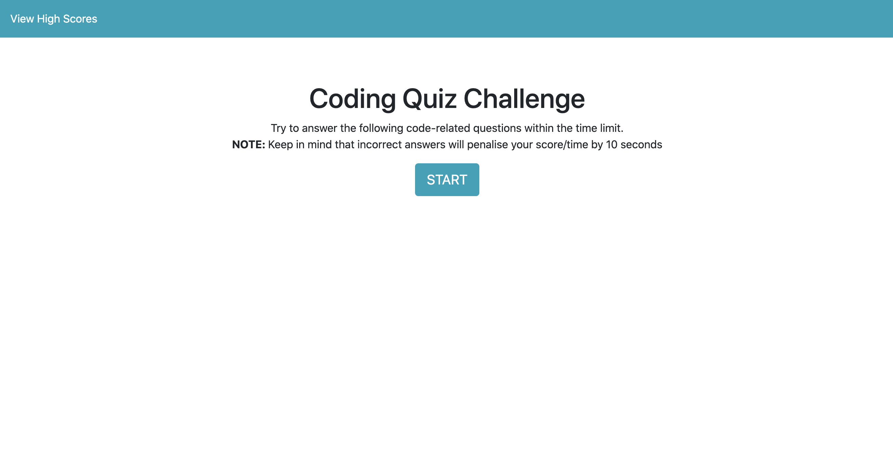
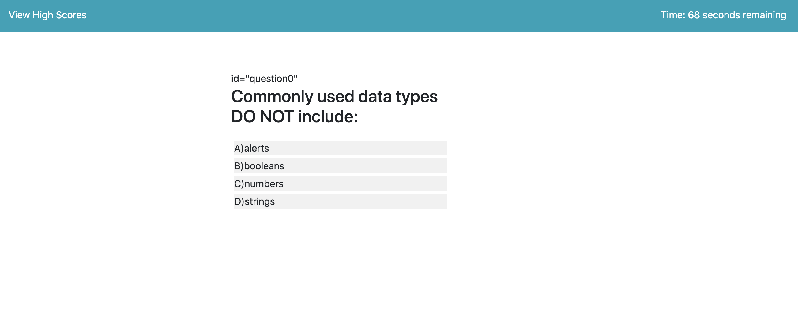

# 04-hw-code-quiz
// Homework Task 04 Web APIs: Code Quiz //

## Contents
<p>
This JavaScript Coding Quiz is composed of 4 pages: index.html, highscores.html, main.js and style.css. The folder also includes some images of the application in /04-hw-screenshots.

## User Story
<p>
The purpose of this project was to create a timer-based JavaScript Coding Quiz. The application has a few Multiple Choice questions for the user to complete. It stores high scores on the user's device. The number of questions decides the length of time for the quiz (15seconds/question). To begin the user must click on the "Start" button and then choose the correct answer for each of the Multiple Choice questions. The user will be alerted when that get an answer right or wrong and the timer will be penalised if they answer the question incorrectly. The final score is based on how many questions the user chose correctly. 
</p> 

## Acceptance Criteria

```
GIVEN I need a new, secure password
WHEN I click the button to generate a password
THEN I am presented with a series of prompts for password criteria
WHEN prompted for password criteria
THEN I select which criteria to include in the password
WHEN prompted for the length of the password
THEN I choose a length of at least 8 characters and no more than 128 characters
WHEN prompted for character types to include in the password
THEN I choose lowercase, uppercase, numeric, and/or special characters
WHEN I answer each prompt
THEN my input should be validated and at least one character type should be selected
WHEN all prompts are answered
THEN a password is generated that matches the selected criteria
WHEN the password is generated
THEN the password is either displayed in an alert or written to the page
```

## Built With
* [Terminal]
* [VScode](https://code.visualstudio.com/) - The editor of choice

#### Initial Interface

Format: ](url)


Format: ](url)

####Licence
Not applicable for this task

### Link to the App
<a href="file:///Users/sarahronald/coding-bootcamp-homework/04-hw-code-quiz/index.html">Link to the App</a><hr>

## Authors
* **SARAH RONALD** - 
Contact information:
sareronald@hotmail.com

